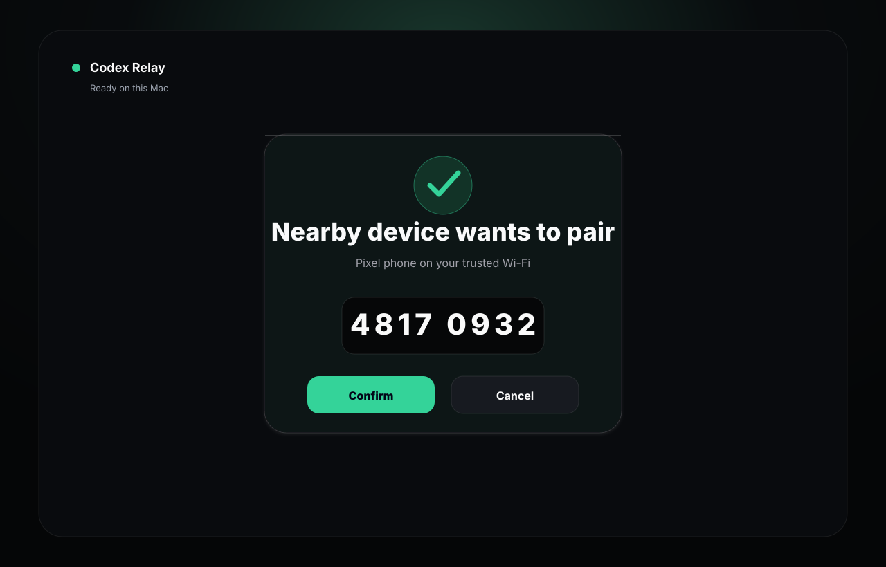
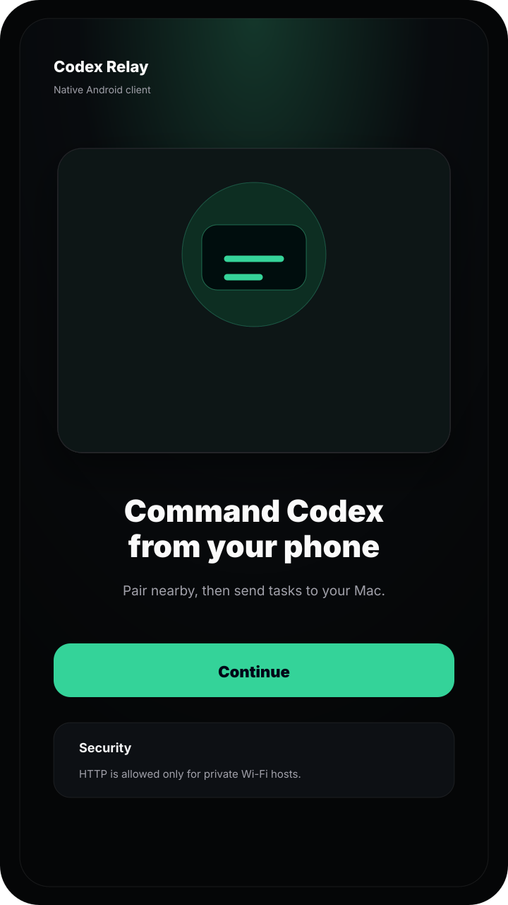
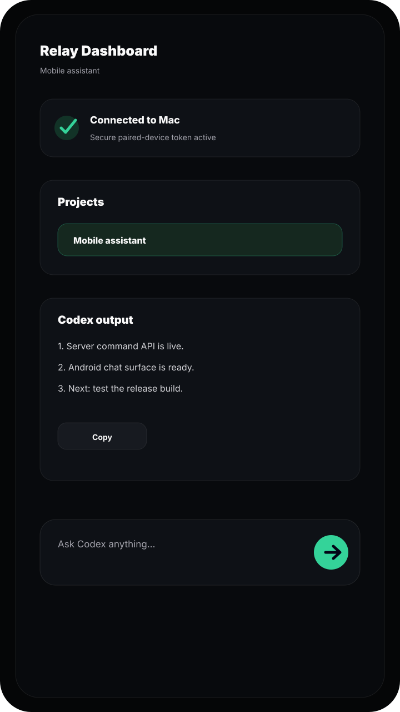

# Codex Relay

Codex Relay is a local command bridge for controlling Codex from a paired Android phone. It includes a Node.js app-server, a polished local web pairing screen, and a native Android client.

> Security note: this project can start Codex and send commands on your Mac. Keep the server on localhost by default, pair only on trusted Wi-Fi, and use HTTPS for any remote access.

## Screenshots



| Android connect | Android dashboard |
| --- | --- |
|  |  |

## What You Get

- Local web pairing screen with one-time 8-digit pairing codes.
- Native Android app, not a WebView shell.
- Paired-device token auth for future reconnects.
- Project picker, slash commands, file mentions, image attachment upload, and Codex result rendering.
- Safe open-source defaults: localhost server binding, ignored `.env`, HTTPS-required remote mode, and no auto-installed APK updates.

## Requirements

- macOS or Linux host with Node.js 20+.
- Codex CLI installed and available as `codex`.
- Android Studio, or JDK plus Gradle, to build the Android app locally.
- Phone and computer on the same trusted Wi-Fi for first pairing.

## Quick Start

1. Install dependencies:

   ```bash
   npm install
   ```

2. Generate a private local `.env`:

   ```bash
   npm run setup
   ```

3. For browser-only local testing, start the server:

   ```bash
   npm start
   ```

   Open `http://localhost:8787`.

4. To pair an Android phone on trusted Wi-Fi, edit `.env` and set:

   ```bash
   HOST=0.0.0.0
   ```

   Then restart:

   ```bash
   npm start
   ```

5. Build and install the Android app:

   ```bash
   cd android-native
   ./build-apk.sh
   ```

   The local debug APK is created at `android-native/app/build/outputs/apk/debug/app-debug.apk`.

6. Open the Android app and tap **Continue**.

7. Confirm the pairing request on the web screen on your Mac, then enter the 8-digit code shown there.

After pairing, the phone stores an encrypted paired-device token and reconnects automatically while the server is reachable.

## Remote Access

Do not port-forward this server directly from your router.

For away-from-home use, pair once nearby first, then expose the server through a trusted HTTPS tunnel or reverse proxy:

```bash
cloudflared tunnel --url http://localhost:8787
```

Set these values in `.env`:

```bash
TRUST_PROXY=true
PUBLIC_URL=https://your-secure-tunnel.example
```

Remote HTTP URLs are rejected by the Android app. HTTPS is required outside private local-network addresses.

## Configuration

Copy `.env.example` or run `npm run setup`.

| Variable | Default | Purpose |
| --- | --- | --- |
| `REMOTE_TOKEN` | generated | Private legacy token. Device tokens are preferred. |
| `PORT` | `8787` | App-server port. |
| `HOST` | `127.0.0.1` | Bind address. Use `0.0.0.0` only for trusted Wi-Fi pairing. |
| `CODEX_COMMAND` | `codex` | Command used to start Codex. |
| `CODEX_WORKDIR` | current folder | Default workspace. |
| `CODEX_PROJECT_ROOTS` | parent folder | Folders exposed in the project picker. |
| `TRUST_PROXY` | `false` | Trust `X-Forwarded-Proto` only behind your HTTPS proxy. |
| `PUBLIC_URL` | empty | Optional HTTPS tunnel URL for QR output. |

## GitHub Actions

The **Build Android APK** workflow is manual and builds an unsigned release APK artifact. It does not publish debug APKs as public releases.

If you want signed public releases, add your own signing configuration and release process. Keep signing keys out of the repo.

## Security Model

- `.env` is ignored and should never be committed.
- Pairing codes are one-time, short-lived, and visible only from the Mac web UI.
- First pairing must start from the same local network.
- Android stores paired-device tokens with AndroidX encrypted preferences.
- Remote access requires HTTPS.
- The Android app opens configured release pages for updates; it does not download or install APKs itself.

## Development

Check the server syntax:

```bash
npm run check
```

Audit production dependencies:

```bash
npm audit --omit=dev
```

Regenerate icon PNGs after editing SVG assets:

```bash
npm run build:icons
```

## License

MIT
